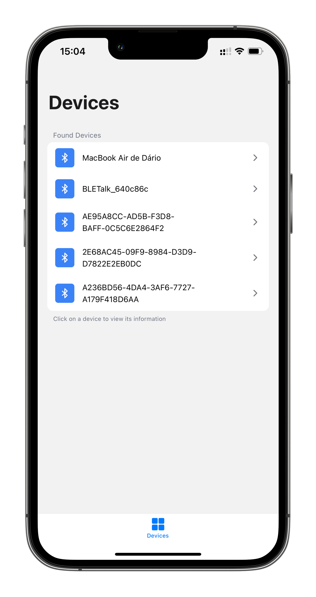
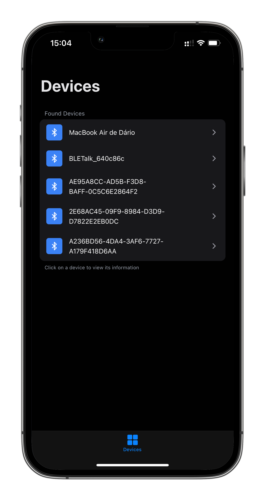
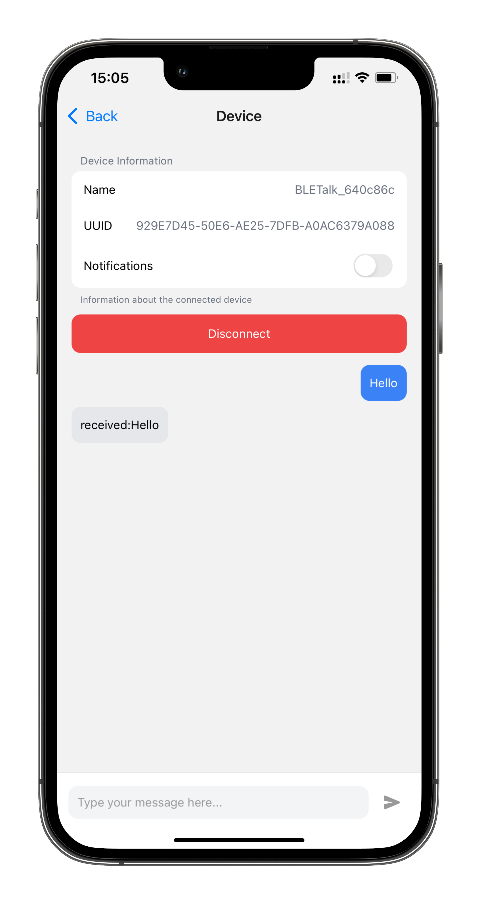
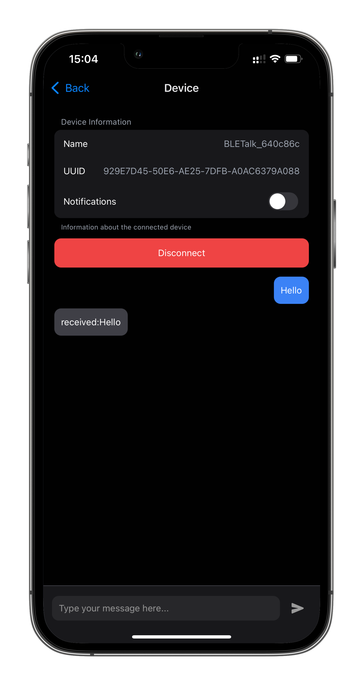

# BLETalk
_Connecting Devices, Empowering Innovation Seamlessly_


_Built with the following tools and technologies:_


---

## Table of Contents

- [Overview](#overview)
- [Features](#features)
- [Screenshots](#screenshots)
- [Getting Started](#getting-started)
  - [Prerequisites](#prerequisites)
  - [Installation](#installation)
  - [Usage](#usage)
  - [Testing](#testing)
- [Contributing](#contributing)
- [License](#license)

---

## Overview

**BLETalk** is a robust React Native toolkit designed to simplify Bluetooth Low Energy (BLE) interactions in cross-platform mobile applications. It empowers developers to build connected apps with seamless device management, real-time messaging, and a polished, customizable UI. With a focus on scalability and developer experience, BLETalk streamlines BLE development for iOS and Android.

**Why Choose BLETalk?**

BLETalk combines powerful BLE functionality with a modern development stack, enabling rapid prototyping and production-ready applications. Whether you're building IoT solutions or connected mobile apps, BLETalk provides the tools you need to succeed.

---

## Features

- 🧩 **Effortless BLE Management**: Scan, pair, and communicate with BLE devices with a simple, intuitive API.
- 🌈 **Cross-Platform Styling**: Unified UI with Tailwind CSS, NativeWind, and Expo for a consistent look across platforms.
- 📱 **Reusable UI Components**: Modular buttons, containers, headers, and navigation for faster development.
- 🚀 **Developer-Friendly Tools**: TypeScript, ESLint, Prettier, and Babel ensure clean, maintainable code.
- 🔒 **Permissions & Notifications**: Simplified handling of Bluetooth, location permissions, and background notifications.
- ⚙️ **Flexible Architecture**: Configurable setup supporting iOS, and Android with minimal configuration.
- 🌙 **Light & Dark Mode**: Automatically adapts to device theme settings for an enhanced user experience.

---

## Screenshots

Explore BLETalk's user interface in both light and dark modes:

| Home Screen (Light) | Home Screen (Dark) | Device Details (Light) | Device Details (Dark) |
|---------------------|--------------------|------------------------|-----------------------|
|  |  |  |  |
| *List of BLE devices in light mode* | *List of BLE devices in dark mode* | *Device details in light mode* | *Device details in dark mode* |

*Note*: Two additional screenshots (`IMG_0076-portrait.png`, `IMG_0077-portrait.png`) are available and can be added upon request.

---

## Getting Started

### Prerequisites

Ensure you have the following installed:

- **Node.js**: Version 16 or higher
- **npm**: Version 8 or higher
- **TypeScript**: For type-safe development
- **Expo CLI**: For running and building the app
- **Git**: For cloning the repository

### Installation

1. **Clone the Repository**:
   ```bash
   git clone https://github.com/BirdRa1n/BLETalk
   cd BLETalk
   ```

2. **Install Dependencies**:
   ```bash
   npm install
   ```

3. **Set Up Environment**:
   - Configure your `.env` file for API keys or BLE settings (if applicable).
   - Ensure Bluetooth and location permissions are enabled in your development environment.

### Usage

1. **Run the App**:
   ```bash
   npm start
   ```
   Use Expo CLI to launch the app on iOS, Android, or web.

2. **Build for Production**:
   ```bash
   npm run build
   ```

### Testing

Run tests to ensure everything works as expected:
```bash
npm test
```

For linting and formatting:
```bash
npm run lint
npm run format
```

---

## Contributing

We welcome contributions to BLETalk! To get started:

1. Fork the repository.
2. Create a feature branch (`git checkout -b feature/YourFeature`).
3. Commit your changes (`git commit -m "Add YourFeature"`).
4. Push to the branch (`git push origin feature/YourFeature`).
5. Open a pull request.

Please follow our [Code of Conduct](CODE_OF_CONDUCT.md) and ensure your code adheres to the project's ESLint and Prettier configurations.

---

## License

This project is licensed under the MIT License. See the [LICENSE](LICENSE) file for details.
